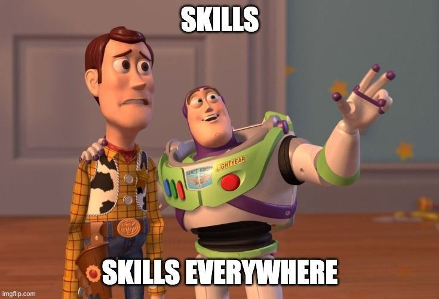

# Skills: multiplica tu productividad con la IA

> Masterclass en [Web Reactiva Premium](https://webreactiva.com)





## Sobre este taller

Aprende a crear **skills para agentes de IA** desde cero. De la primera skill en un solo archivo a skills avanzadas con scripts, references y assets.

## Contenido

- Que es una skill y por que la necesitas
- Anatomia de una skill: frontmatter, body, progressive disclosure
- 5 patrones de diseno: Workflow, Task, Reference, Capabilities, Decision Trees
- Skills vs MCP, Agents, Commands y CLAUDE.md
- Crear skills desde bases de conocimiento y desde problemas reales
- Evaluar skills con Skill Judge

## Slides

```
workshop-skills-slides.md
workshop-skills-slides.html
```

Usa [Marp](https://marp.app/) para visualizar las slides.

Hecho con 🧡 para la Comunidad Malandriner
